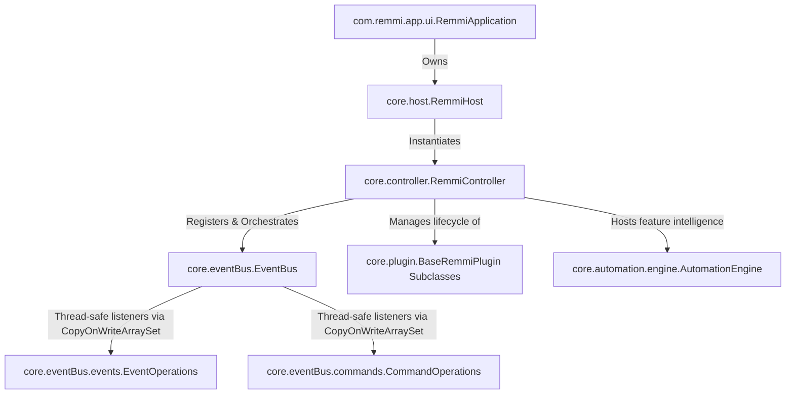

# REMMI SYSTEM ARCHITECTURE & INTERCOMMUNICATION MAP

This living document details the comprehensive topology, dependencies, plugin models, and asynchronous EventBus protocols governing the Remmi runtime environment.

---

## 1. GLOBAL SYSTEM ROUTING & DEPENDENCY TREE

### Core Framework Responsibilities
* **`RemmiApplication`**: Application global lifecycle hook. Holds the active `RemmiHost` singleton to survive configuration changes and background thread restarts.
* **`RemmiHost`**: Top-level coordinator. Orchestrates safe startup (`start()`) and teardown (`stop()`) boundaries within specialized lifecycle coroutines.
* **`RemmiController`**: Central registry and component container. Resolves dependencies dynamically by type and governs modular component states.
* **`EventBus`**: Decoupled message matrix. Separates intents (Commands) from completed facts (Events). Backed by concurrent `CopyOnWriteArraySet` collections to ensure thread safety across asynchronous background dispatch loops.

---

## 2. EVENTBUS CONTRACT PROTOCOLS

Cross-boundary communication **must strictly utilize** the EventBus channel operations to avoid direct plugin tight coupling.

### A. Intent Pipelines (Commands)
Commands represent an explicit request for action distributed to specialized handlers.

| Command Class Name | Emitting Domain | Primary Handling Destination | Operational Payload Description |
| :--- | :--- | :--- | :--- |
| `SaveDataCommand` | System / Core Shell | Database Client Layer | Requests a global data synchronization dump to persistence. |
| `UpsertDataCommand<T>` | Plugins / Repositories | Database Client Layer | Requests table insertions or updates for structures extending `RemmiModel`. |
| `DeleteDataCommand` | Plugins / Repositories | Database Client Layer | Requests structural row removal by ID from a specific table name. |
| `BulkDeleteTasksCommand` | Automation / Plugins | `TasksPlugin` | Removes multiple tasks in a single operation, optimizing command bus loops. |
| `SyncPluginDataCommand` | Automation Engine | Target Core Plugin Class | Triggers lazy initialization, remote cloud fetches, or local caches. |
| `FetchAllDataCommand<T>` | Automation / Plugins | Database Client Layer | Retrieves entire tables for synchronization or caching. |
| `PostNotificationCommand` | Automation / Core | `SystemNotificationService` | Triggers a native system tray or persistent foreground notification alert. |
| `PostLiveUpdateCommand` | Background Worker | `SystemNotificationService` | Triggers progressive, progress-bar centric updates matching Android 16+ specs. |
| `CreateAlarmCommand` | Automation / Plugins | `AlarmReceiver` / System | Provisions exact system timing alarms for priority task updates. |

### B. Fact Pipelines (Events)
Events announce a completed lifecycle action. They should never request actions directly.

| Event Class Name | Emitting Domain | Active Intercepting Handlers | Payload Information Content |
| :--- | :--- | :--- | :--- |
| `DataFetchedEvent<T>` | Database Client Layer | Emitting Plugin Repositories | Delivers raw collections matching an upstream request ID. |
| `TaskCreatedEvent` | Tasks Plugin Repository | `AutomationEngine` | Announces a new item. Triggers future priority scheduling alarms if flagged. |
| `CalendarEventDeletedEvent` | Calendar Repository | `AutomationEngine` | Announces an entry removal. Triggers linked timer deletions. |
| `TodayTasksFetchedEvent` | Tasks Repository | `AutomationEngine` / LockScreen | Re-assembles active, non-completed tasks for briefings. |
| `TodayEventsFetchedEvent` | Calendar Repository | `AutomationEngine` / LockScreen | Re-assembles chronologically sorted schedule grids. |
| `WeatherFetchedEvent` | Weather Plugin | `AutomationEngine` / LockScreen | Delivers summaries, temperatures, and atmospheric indexes. |
| `DailyBriefingGeneratedEvent`| `AutomationEngine` | System Context Logs | Broadcasts finalized morning markdown summary logs. |

---

## 3. MODULAR PLUGIN DEEP-DIVES

All standalone sections implement `RemmiPlugin` via `BaseRemmiPlugin` to hook cleanly into the unified shell (`AppNavigation.kt`) without modifying core app code.

### A. Call Recorder Plugin (`plugins.callrecorder`)
* **Purpose**: Background monitoring and capturing of standard telephony state changes and external communication streams.
* **Structural Topology**:

```mermaid
graph LR
    Screen["CallRecorderScreen (Compose UI)"] --> |Toggles| Actions["CallRecorderActions"]
    Actions --> |Governs service state| Service["CallRecorderService (Foreground)"]
    Service --> |Dynamic Receiver| Monitor["CallStateMonitor (BroadcastReceiver)"]
    Monitor --> |State Shift Callbacks| Manager["CallRecordingManager"]
    Manager --> |Drives pipeline| Backend["NativeAndroidRecorder"]
```

* **Core Mechanisms**:
  * Runs as a **`microphone`** foreground service, showing an ongoing user notification utilizing `R.mipmap.ic_launcher`.
  * `CallStateMonitor` catches system broadcasts (`ACTION_PHONE_STATE_CHANGED`, `ACTION_NEW_OUTGOING_CALL`) and tracks transitions (`RINGING`/`IDLE` $\rightarrow$ `OFFHOOK`).
  * `NativeAndroidRecorder` captures stream bits utilizing `MediaRecorder`. It prioritizes `AudioSource.VOICE_COMMUNICATION` for acoustic noise cancellations, with a robust fallback to `AudioSource.MIC` to guarantee execution.
  * *Modern Android Constraints:* On modern unrooted systems, lines are protected. Using Speakerphone during active calls enables the `MIC` fallback to perfectly capture both conversation tracks. Requires `RECORD_AUDIO`, `READ_PHONE_STATE`, and `READ_CALL_LOG` permissions.

### B. Automation Engine (`core.automation.engine`)
* **Purpose**: The central cross-plugin intelligence corridor. Listens to distributed facts and compiles smart reactive actions without tight couplings.
* **Owned Feature Managers**:
  * **`LockScreenManager`**: Intercepts data packets, formatting a structured summary (Weather limits, cron schedule, uncompleted task list) into a persistent `remmi_summary` lock screen notification.
  * **`DatabaseCleaner`**: Automatically invokes row compression/maintenance sweeps during database fetch queries.
  * **Daily Briefing Subsystem**: Combines asynchronous streams (`TodayTasksFetchedEvent`, `TodayEventsFetchedEvent`, `WeatherFetchedEvent`) into a single unified morning memo string, appending logic prompts like: *"Recommendation: Rain expected. Take an umbrella!"*

---

## 4. UI ARCHITECTURE & IMPEDANCE MATRIX

* **Adaptive Shell Framework (`AppNavigation.kt`)**: Implements a Material 3 container where `RemmiBottomNavigation` is hosted explicitly within the `bottomBar` parameter slot of a core `Scaffold`. 
* **Layout Constraints**: The `NavHost` layout modifiers explicitly append `.padding(bottom = padding.calculateBottomPadding())`. This keeps the active drawing layout boundaries ending **exactly above the bottom dock**, protecting screen functionality and click targets across all plugins.
* **Launcher Adaptive Standards**: Configured under `mipmap-anydpi-v26` matching adaptive specs. Standardizes the foreground asset under an inset wrapper (`ic_launcher_foreground.xml` with `16%` internal padding) layered on top of a crisp high-contrast background plate (`#FFFFFF` in `colors.xml`) to maintain professional visibility across all Android device launcher shapes.
